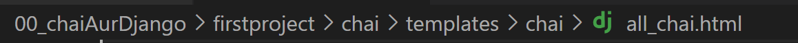

# uv
> pip install uv
package installer faster than pip
like bun in node

# virtual env
just type
> uv venv

# to activate venv
> .venv\Scripts\activate
# to deactivate
> deactivate

# installing
as we made virtual env from uv we have to use
> uv pip install Django

# admin
startproject only for the firsttime
> django-admin startproject projectname
a new project file will be create
there will be same folder name as subfolder (project folder)too
>cd projectname
>python manage.py runserver 
you can give port number also
>python manage.py runserver 8001 #default is 8000

# basic flow of Django
user request goes to Django
it goes to url resolver and
then it goes it Urls.py 
urls.py file send you to views.py -> main controller 
from there(views.py) we can also call model.py to connect with db
and from views.py the res goes striaght to Django or (template) and back to client


# Django template language (DTL)
also known as Jinja

# startapp
> python manage.py startapp cha
 now we have to make the system aware that new app is created
 1. go in setting.py in firstproject file
```js 
INSTALLED_APPS = [
    'django.contrib.admin',
    'django.contrib.auth',
    'django.contrib.contenttypes',
    'django.contrib.sessions',
    'django.contrib.messages',
    'django.contrib.staticfiles',
    'chai',
]
```
then we create template in the app and make another file(same name as the app) and a file name this


