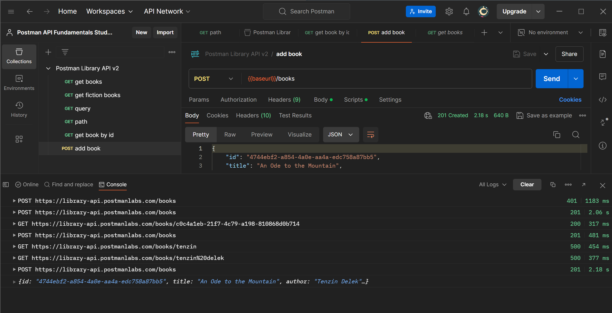
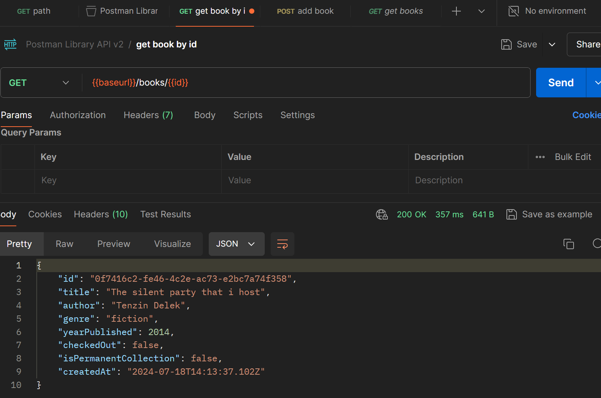

# API
An Application Programming Interface (API) is a contract that allows code to talk to other code. APIs are the building blocks of modern software because they allow for sharing of resources and services across applications, organizations, and devices.

# Why are APIs important?
1. APIs help developers integrate exciting features and build automation without reinventing the wheel
ex: using a Weather API instead of launching your weather balloons

2. APIs allow enterprises to open up their product for faster innovation
ex: apps that interact with Twitter or Meta APIs by posting on your behalf or reading tweets

3. APIs can be products themselves
ex: Software as a Service (SaaS) products like Stripe's payment APIs or Twilio's text messaging and email APIs

- You can think of APIs as being like a waiter at a restaurant, serving as a go-between for the customer and the kitchen. 

- A customer who wants soup doesn't go into the kitchen to cook. They don't even have to know how to make soup! They only have to know how to ask the waiter for soup, expecting the waiter to bring back soup.

# Types:
While this course will focus on Web APIs, it is important to know that "API" can apply to a broad range of interfaces.

- Hardware APIs
Interface for software to talk to hardware.
Example: How your phone's camera talks to the operating system. 

- Software Library APIs
Interface for directly consuming code from another code base.
Example: Using methods from a library you import into your application.

- Web APIs
Interface for communicating across code bases over a network.
Example: Fetching current stock prices from a finance API over the internet.

# Architectures
- REST (Representational State Transfer) (most used)
- GraphQL
- WebSockets
- webhooks
- SOAP (Simple Object Access Protocol)
- gRPC (Google Remote Procedure Call)
- MQTT (MQ Telemetry Transport)

# REST APIs
Some traits of REST APIs include not storing session state between requests, the ability to cache, and the ability to send and receive various data types.

# Access
1. Public API
2. Private API
3. Partner API

# postman
working with api before was 
- using cURL (have many limitation)
>curl https://api.github.com/users/postmanlabs

- now a days we use postman

The client is the agent making a request. A client could be a browser or an application you have coded, for example. In our case Postman is the client because that's how we sent the request. 

The request is sent over a network to some server. In our case, we made a request over the public internet to a server located at the address https://library-api.postmanlabs.com. 

The server interpreted the request (GET /books) and sent the appropriate response over the network back to the Postman client: a list of books.

>protocol:https://	

>host: library-api.postman.labs.com	/

>path:/books

# Variables in Postman
Postman allows you to save values as variables to reuse them and easily hide sensitive information like API Keys. 

- We will use a variable to replace our base URL so that we don't have to type that repeatedly. Once a variable is defined, you can access its value using double curly brace syntax like this: 
{{variableName}}

### Set the "baseUrl" variable
1. Go to the "get books" request in your collection.
2. With your cursor, select the entire base URL of the API (https://library-api.postmanlabs.com). Do not include the slash / after .com.

3. Click "Set as variable" to save the base URL to a variable.
>{{baseurl}}/books

# Where are my variables?
You can find Collection variables in your collection.

Click on your collection, then the Variables tab. Here you can view and edit your variables.

- Initial Value - the value initially set when someone forks or imports your collection. Note that if you share your collection with others, they will see this value, so don't put any secrets here!

- Current Value - Postman always resolves the variable to this value. This is local to your Postman account, and not public. It is good to keep secrets like API Keys ONLY in this column and not include them in the Initial Value column.

# Query parameter
Query parameters are added to the end of the path. They start with a question mark ?, followed by the key-value pairs in the format: <key>=<value>
> GET https://some-api.com/photos?orientation=landscape
- If there are multiple query parameters, each is separated by an ampersand &.
>GET https://some-api.com/photos?orientation=landscape&size=500x400

- This request adds a search term as a query parameter q=postman ("q" refers to "query" here) to the GET /search path on Google's server.

at param write the key and val

### multiple parameter

# Path Variable
Another way of passing request data to an API is via path variables (a.k.a. "path parameters"). A path variable is a dynamic section of a path and is often used for IDs and entity names such as usernames. 
>https://api.github.com/users/tenzdelek

- Note that some API documentation uses colon syntax to represent a wildcard in the path like /users/:username, while some use curly braces like /users/{username}. They both mean the same thing: that part of the path is dynamic!

>{{baseurl}}/books/:id
the : will create params key id in it and we have t give the value and run it
- You can see that Postman has inserted the book id as a path parameter in place of the :id placeholder when making the request. Cool!

## dont get confuse by path parameter
A dynamic endpoint would include path parameters
>How many path parameters are in this documented endpoint?

>GET https://library-api.postmanlabs.com/books

here there is 0 path parameter . path parameter are denoted by {} or :

# Post
- we will learn how to add a book via POST request with a JSON Body to submit book data to our Postman Library API database.
### But what is the Body?
- You will need to send body data with requests whenever you need to add or update structured data.

Some APIs require Authorization (aka Auth) for certain endpoints in order to permit a request.

# Authorization
Think about why you might not want an API to have completely open endpoints that anyone can access publicly. It would allow unauthorized people to access data they shouldn't see, or allow bots to flood an API with thousands of calls per second and shut it down. 
- There are multiple methods for authorizing a request. Some examples are 
1. Basic Auth (username and password),
2. OAuth (delegated authorization), and 
3. API Keys (secret strings registered to a developer from an API portal). 

# Getting an API Key
APIs that use API Key auth usually allow developers to sign up in a developer portal, where they will receive a random API Key that can be used to authorize their requests to the API. The API Key allows the API to track who is making calls and how often.
>we added apikey and it value in header

# Headers
Headers are how we can add metadata about our requests, such as authorization information or specify the data type we want to receive in a response. This is different than the actual payload data we send in the body of a request, such as our new book information.

> You can think of headers like the outside of an envelope when you send a letter. The envelope has information about delivering the letter, like proof that you've paid for postage. The actual data "payload" is the letter inside the envelope.
# Add Auth to the Collection
The Postman Auth helper can help you add authorization at the request, folder or collection level.
 - instead of adding to each file we added at colletion
 
 All requests inside this collection that use the auth method "Inherit from parent" will have this header attached, and therefore be authorized.

 - make sure the auth in child file is set to inherit the parent
 

# Variable scopes
You can set variables that live at various scopes. Postman will resolve to the value at the nearest and narrowest scope.

From broadest to narrowest, these scopes are global, collection, environment, data, and local.

>If a variable with the same name is declared in two different scopes, the value stored in the variable with narrowest scope will be used. For example, if there is a global variable named username and a local variable named username, the local value will be used when the request runs.

# Scripting in Postman
Postman allows you to add automation and dynamic behaviors to your collections with scripting.

- Postman will automatically execute any provided scripts during two events in the request flow:

- Immediately before a request is sent: pre-request script (Pre-request Script of Scripts tab).
Immediately after a response comes back: post-response script (Post-response of Scripts tab).

# The pm object
- Postman has a helper object named pm that gives you access to data about your Postman environment, requests, responses, variables and testing utilities. 

- For example, you can access the JSON response body from an API with: 

>pm.response.json()

You can also programmatically get collection variables like the value of baseUrl with:

>pm.collectionVariables.get(“baseUrl”)

In addition to getting variables, you can also set them with pm.collectionVariables.set("variableName", "variableValue") like this:

>pm.collectionVariables.set(“myVar”, “foo”)

# Add a script to your request
1. In your "add a book" request, change the book data in your Body to a new book you like.

2. From the Scripts tab of your request, open the Post-res tab (short for Post-response)

3. Inside the Script editor, add this JavaScript code to log the JSON response from the API:
>console.log(pm.response.json())

so in console you can see it

# Setting and getting collection variables
The pm object allows you to set and get collection variables.

- To set a collection variable, use the .set() method with two parameters: the variable name and the variable value

>pm.collectionVariables.set("variableName", value)

- To get a collection variable use the .get() method and specify the name of the variable you want to retrieve:

>pm.collectionVariables.get("variableName")

after we run this we get:

now this can be used all over the children

# Patch
updating

# Delete
- delete is same

# code snippet
you can use code snippet to do it from many other platform

